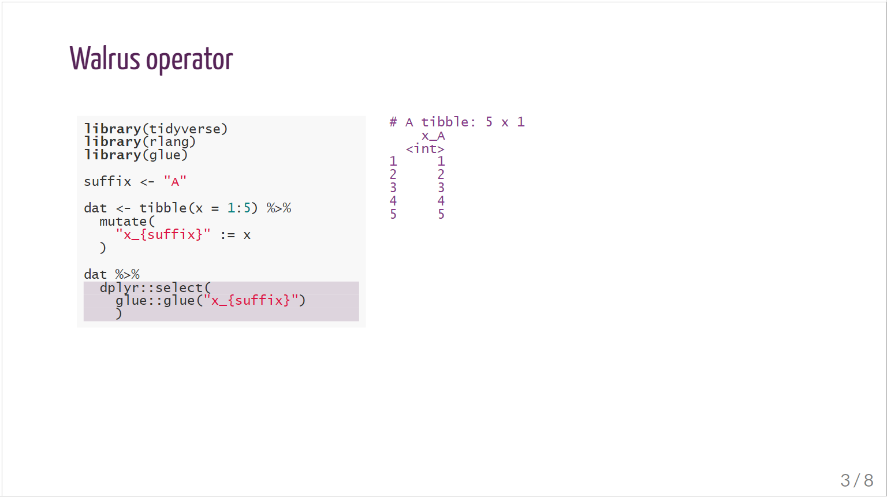

# rladies-flipbookr

This content shows how to create code demonstrations in flipbookr with CSS inspired by R-Ladies, and goes with my blog post [R-Ladies styled code gifs with xaringan and flipbookr](https://www.pipinghotdata.com/posts/2021-03-08-r-ladies-styled-code-gifs-with-xaringan-and-flipbookr/). CSS adjustments were kindly developed by Silvia Canelón.

These demos take a while to run because of content `4. haven + gtsummary`.  This is left here for full reproducibility; removing this content will speed up rendering.


* `rladies_default` shows flipbookr output using the default xaringan rladies theme

* `rladies_adjusted_1` shows flipbookr output with modifications on the xaringan rladies theme through a css code chunk in the markdown document (increased font size on code, lighter shade on highlight)

* `rladies_adjusted_2` shows the same modifications, but by calling a separate css sheet rather than using a css code chunk


### Default RLadies theme


### Adjusted RLadies theme




### A note on calling a separate CSS sheet

My first attempt on `rladies_adjusted_2` had this in the `yaml`:

`css: ["default", "css/my-css-sheet.css"]`

However, the header fonts did not render. The fix was to modify to

`css: ["default", "default-fonts", "css/shannon-theme.css"]`

which is shown in `rladies_adjusted_2`. The inclusion of `default-fonts` allows access to all fonts pre-loaded to xaringan.  

An alternative solution is to split the CSS code into two sheets: one for styling and one for fonts, and refer to both of them in your `yaml`. Add code to your fonts CSS sheet to import the Google fonts you want to use (like you see in [rladies-fonts.css](https://github.com/yihui/xaringan/blob/master/inst/rmarkdown/templates/xaringan/resources/rladies-fonts.css)).

So in your `yaml` you would have

`css: ["default", "css/shannon-theme-fonts.css", "css/shannon-theme.css"]`

and in `css/shannon-theme-fonts.css`

```
@import url(https://fonts.googleapis.com/css?family=Lato);
@import url(https://fonts.googleapis.com/css?family=Yanone+Kaffeesatz);
@import url('https://fonts.googleapis.com/css?family=Inconsolata:400,700');
```


